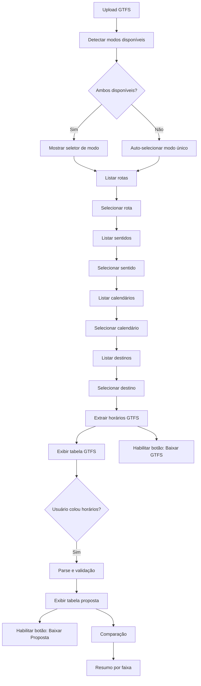

# Migração do App de Análise QH: R Shiny → Python Streamlit

## Contexto

O projeto atual é um app **R Shiny** ([1.1 app_format_qh.R](file:///c:/Users/arauj/OneDrive/Documents/Projetos/analise_qh/codigos/1.1%20app_format_qh.R)) que analisa dados GTFS para comparar quadros horários (QH) de linhas de ônibus. Ele permite:

1. Carregar um arquivo GTFS (ZIP)
2. Selecionar linha, sentido, calendário e destino
3. Visualizar a tabela de horários do GTFS (gerada a partir de `frequencies.txt`)
4. Colar uma programação proposta manualmente
5. Comparar as duas tabelas (GTFS vs. Proposta)
6. Ver um resumo de partidas por faixa horária
7. Exportar o resultado em CSV

### Limitação Atual
O app **só funciona com GTFS baseados em `frequencies.txt`**. Se o GTFS utiliza `stop_times.txt` com horários fixos (timetable), a função `get_gtfs_schedule()` retorna `NULL` e a aplicação não exibe dados.

---

## Decisões Confirmadas

| Questão | Decisão |
|---|---|
| **Framework** | Streamlit (deploy via Streamlit Cloud) |
| **Extração timetable** | `departure_time` do 1º stop (`stop_sequence` mínimo) de cada trip |
| **Versão Python** | 3.10+ |
| **Biblioteca GTFS** | gtfs-kit (parser principal com DataFrames pandas) |
| **Código R** | Mantido intacto durante toda a migração |

---

## User Review Required

> [!WARNING]
> **Código R original**: O arquivo R será **mantido intacto** durante toda a migração. Só será removido/arquivado após validação completa do novo app Python, caso você deseje.

---

## Arquitetura Proposta

A arquitetura segue o princípio de **separação de responsabilidades**, dividindo o projeto em módulos claros:

```
analise_qh/
├── codigos/                          # (mantido — código R original)
│   └── 1.1 app_format_qh.R
├── app/                              # [NEW] — App Python
│   ├── main.py                       # Ponto de entrada Streamlit
│   ├── config.py                     # Constantes (cores, faixas horárias, etc.)
│   ├── gtfs_loader.py                # Carregamento e cache do GTFS
│   ├── schedule_extractor.py         # Extração de horários (frequencies + timetable)
│   ├── user_input_parser.py          # Parse dos horários colados pelo usuário
│   ├── comparison_engine.py          # Lógica de comparação GTFS vs. Proposta
│   ├── export_handler.py             # Lógica de exportação (CSV, TXT)
│   └── ui_components.py              # Componentes de UI reutilizáveis (tabelas coloridas)
├── tests/                            # [NEW] — Testes unitários
│   ├── __init__.py
│   ├── test_schedule_extractor.py
│   ├── test_user_input_parser.py
│   ├── test_comparison_engine.py
│   └── test_export_handler.py
├── requirements.txt                  # [NEW] — Dependências Python
├── .gitignore                        # [MODIFY] — Adicionar padrões Python
├── README.md                         # [MODIFY] — Documentar o novo app
└── analise-qh.Rproj                  # (mantido)
```

---

## Proposed Changes

### 1. Configuração do Projeto

#### [NEW] [requirements.txt](file:///c:/Users/arauj/OneDrive/Documents/Projetos/analise_qh/requirements.txt)

Dependências do projeto Python:

```
streamlit>=1.40.0
pandas>=2.0.0
gtfs-kit>=7.0.0
numpy>=1.24.0
pytest>=7.0.0
```

#### [MODIFY] [.gitignore](file:///c:/Users/arauj/OneDrive/Documents/Projetos/analise_qh/.gitignore)

Adicionar padrões Python ao `.gitignore` existente:

```diff
 .Rproj.user
 .Rhistory
 .RData
 .Ruserdata
+
+# Python
+__pycache__/
+*.pyc
+*.pyo
+.venv/
+venv/
+*.egg-info/
+dist/
+build/
+.pytest_cache/
+.streamlit/secrets.toml
```

---

### 2. Módulo de Configuração

#### [NEW] [config.py](file:///c:/Users/arauj/OneDrive/Documents/Projetos/analise_qh/app/config.py)

Centraliza todas as constantes extraídas do código R original:

- **`GTFSMode`**: Enum com dois valores — `FREQUENCIES` e `TIMETABLE` — usado pelo seletor na UI
- **`ExportFormat`**: Enum com dois valores — `CSV` e `TXT` — usado pelo sistema de exportação
- **`TIME_COLORS`**: Dicionário mapeando faixas horárias → cores de fundo (replica a função `get_time_color()` do R)
- **`TIME_PERIODS`**: Lista de faixas horárias para o resumo (ex: `"00:00-00:59"`, `"06:00-08:59"`, etc.)
- **`BREAKS`**: Lista de breakpoints para agrupar partidas por faixa

```python
from enum import Enum

class GTFSMode(Enum):
    FREQUENCIES = "frequencies"
    TIMETABLE = "timetable"

class ExportFormat(Enum):
    CSV = "csv"
    TXT = "txt"
```

---

### 3. Carregamento do GTFS

#### [NEW] [gtfs_loader.py](file:///c:/Users/arauj/OneDrive/Documents/Projetos/analise_qh/app/gtfs_loader.py)

Responsabilidades:
- Carregar o arquivo ZIP usando `gtfs-kit` → retorna um objeto `Feed` com DataFrames
- Detectar automaticamente se o feed contém `frequencies.txt` e/ou horários fixos em `stop_times.txt`
- Extrair as **rotas disponíveis** (equivalente ao `route_choices` do R)
- Filtrar **trips** por `route_id`, `direction_id`, `service_id`, `trip_headsign`
- Usar `@st.cache_data` para cachear o GTFS em memória (evita recarregar a cada interação)

Funções principais:

| Função | Assinatura | Retorno |
|---|---|---|
| `load_gtfs` | `(file_path: str) -> Feed` | Objeto Feed do gtfs-kit |
| `detect_feed_mode` | `(feed: Feed) -> set[GTFSMode]` | Conjunto de modos disponíveis |
| `get_route_choices` | `(feed: Feed) -> list[dict]` | Lista de `{route_id, route_short_name, label}` |
| `get_filtered_trips` | `(feed, route_id, direction_id, service_id, headsign) -> DataFrame` | Trips filtradas |
| `get_available_directions` | `(feed, route_id) -> list[str]` | direction_ids disponíveis |
| `get_available_services` | `(feed, route_id, direction_id) -> list[str]` | service_ids disponíveis |
| `get_available_headsigns` | `(feed, route_id, direction_id) -> list[str]` | trip_headsigns disponíveis |

---

### 4. Extração de Horários (core da mudança)

#### [NEW] [schedule_extractor.py](file:///c:/Users/arauj/OneDrive/Documents/Projetos/analise_qh/app/schedule_extractor.py)

Este é o **módulo mais crítico** — contém a lógica que diferencia frequencies de timetable.

##### Modo FREQUENCIES (comportamento atual do R)
Replica a função `get_gtfs_schedule()` do R:
1. Filtra `frequencies.txt` pelos `trip_id`s relevantes
2. Para cada linha: gera horários de partida via `range(start_seconds, end_seconds, headway_secs)`
3. Remove duplicatas e ordena
4. Retorna DataFrame com coluna `departure_time`

##### Modo TIMETABLE (nova funcionalidade)
1. Filtra `stop_times.txt` pelos `trip_id`s relevantes
2. Para cada trip, pega o `departure_time` do **primeiro stop** (`stop_sequence` mínimo)
3. Converte para segundos, remove duplicatas, ordena
4. Retorna DataFrame com coluna `departure_time` (mesmo formato do modo frequencies)

**Design key**: Ambos os modos retornam um DataFrame com **a mesma interface** (`departure_time` como string `HH:MM:SS`), garantindo que todo o restante do app funcione sem alteração.

```python
def extract_schedule(
    feed: Feed,
    trip_ids: list[str],
    mode: GTFSMode
) -> pd.DataFrame:
    """
    Retorna DataFrame com coluna 'departure_time' (str HH:MM:SS).
    Funciona para ambos os modos via strategy pattern.
    """
    if mode == GTFSMode.FREQUENCIES:
        return _extract_from_frequencies(feed, trip_ids)
    elif mode == GTFSMode.TIMETABLE:
        return _extract_from_timetable(feed, trip_ids)
```

Funções auxiliares:

| Função | Descrição |
|---|---|
| `_extract_from_frequencies` | Replica lógica do R: expande headways em horários individuais |
| `_extract_from_timetable` | **Nova**: extrai departure_time do 1º stop de cada trip |
| `_seconds_to_time_str` | Converte segundos → `"HH:MM:SS"` (suporta horas > 24) |
| `_time_str_to_seconds` | Converte `"HH:MM:SS"` → segundos |
| `add_schedule_metadata` | Adiciona colunas: `numero`, `hora`, `intervalo` (minutos) |

---

### 5. Parser de Input do Usuário

#### [NEW] [user_input_parser.py](file:///c:/Users/arauj/OneDrive/Documents/Projetos/analise_qh/app/user_input_parser.py)

Replica a lógica de `horarios_programados` e `user_schedule_processed` do R:

| Função | Descrição |
|---|---|
| `parse_user_times(text: str) -> list[int] \| None` | Valida formato HH:MM:SS, converte para segundos, ajusta rollover (> 24h) |
| `build_user_schedule_df(seconds: list[int]) -> DataFrame` | Cria DataFrame com `departure_time`, `numero`, `hora`, `intervalo` |
| `build_frequencies_from_user(seconds, route_name, headsign) -> DataFrame` | Agrupa horários consecutivos com mesmo intervalo em faixas de frequência (lógica do `user_schedule_processed`) |

A validação `parse_user_times` segue a mesma regex do R: `^([0-2]?[0-9]):[0-5][0-9]:[0-5][0-9]$`

---

### 6. Motor de Comparação

#### [NEW] [comparison_engine.py](file:///c:/Users/arauj/OneDrive/Documents/Projetos/analise_qh/app/comparison_engine.py)

Replica a lógica complexa de `output$comparison_table` do R. Este é o módulo mais delicado da migração.

**Algoritmo de comparação** (preservado do R):
1. Arredonda todos os horários para o minuto mais próximo
2. Para cada horário do usuário, encontra o horário GTFS mais próximo (`find_nearest_time`)
3. Faz `left_join` do GTFS com o usuário via `nearest_gtfs_time`
4. Trata horários não pareados (unmatched)
5. Remove duplicatas via lógica de "manter o mais próximo" (difere se `len(gtfs) <= len(user)`)
6. Calcula comparação: `↑` (intervalo aumentou), `↓` (diminuiu), `=` (igual), `-` (sem par)

Funções:

| Função | Descrição |
|---|---|
| `compare_schedules(gtfs_df, user_df) -> DataFrame` | Função principal, retorna tabela de comparação |
| `_round_to_minute(seconds: int) -> int` | Arredonda para minuto |
| `_find_nearest(value, candidates) -> value` | Encontra o mais próximo |
| `build_summary_by_period(gtfs_hours, user_hours) -> DataFrame` | Resumo de partidas por faixa horária |

---

### 7. Módulo de Exportação

#### [NEW] [export_handler.py](file:///c:/Users/arauj/OneDrive/Documents/Projetos/analise_qh/app/export_handler.py)

Módulo dedicado a todas as operações de exportação/download. Centraliza a lógica para evitar duplicação no `main.py`.

##### Regras de exportação por modo e origem dos dados

O sistema de exportação oferece **4 botões de download** na sidebar, organizados em dois grupos:

**Grupo 1 — Exportar dados do GTFS (sempre disponível após seleção completa dos filtros):**

| Botão | Modo | Formato | Conteúdo | Nome do arquivo |
|---|---|---|---|---|
| 📥 Baixar GTFS (CSV) | `FREQUENCIES` | `.csv` | DataFrame com colunas: `trip_id`, `trip_headsign`, `trip_short_name`, `start_time`, `end_time`, `headway_secs` (formato de frequências reconstruído a partir do schedule) | `gtfs_{linha}_{destino}_{calendario}.csv` |
| 📥 Baixar GTFS (TXT) | `TIMETABLE` | `.txt` | Lista simples de horários de partida, um por linha: `HH:MM:SS` | `gtfs_{linha}_{destino}_{calendario}.txt` |

> [!NOTE]
> No modo **FREQUENCIES**, o GTFS é exportado em CSV porque os dados são estruturados (faixas com headway). No modo **TIMETABLE**, o GTFS é exportado em TXT porque é uma lista simples de partidas fixas.

**Grupo 2 — Exportar dados da proposta do usuário (disponível apenas quando o usuário colou horários):**

| Botão | Modo | Formato | Conteúdo | Nome do arquivo |
|---|---|---|---|---|
| 📥 Baixar Proposta (CSV) | `FREQUENCIES` | `.csv` | DataFrame com colunas: `trip_id`, `trip_headsign`, `trip_short_name`, `start_time`, `end_time`, `headway_secs` (frequências agrupadas a partir dos horários colados — lógica do `user_schedule_processed` do R) | `proposta_{linha}_{destino}_{calendario}.csv` |
| 📥 Baixar Proposta (TXT) | `TIMETABLE` | `.txt` | Lista simples de horários de partida colados pelo usuário, um por linha: `HH:MM:SS` | `proposta_{linha}_{destino}_{calendario}.txt` |

> [!IMPORTANT]
> O **formato de exportação é determinado pelo modo GTFS selecionado**, não por escolha do usuário. Isso garante consistência: se o feed é de timetable, ambos os downloads (GTFS e proposta) são TXT. Se é de frequencies, ambos são CSV.

##### Lógica resumida

```python
def get_export_format(mode: GTFSMode) -> ExportFormat:
    """Determina o formato de exportação baseado no modo GTFS."""
    match mode:
        case GTFSMode.FREQUENCIES:
            return ExportFormat.CSV
        case GTFSMode.TIMETABLE:
            return ExportFormat.TXT
```

##### Funções do módulo

| Função | Assinatura | Descrição |
|---|---|---|
| `get_export_format` | `(mode: GTFSMode) -> ExportFormat` | Determina formato baseado no modo |
| `build_export_filename` | `(prefix: str, route: str, headsign: str, service: str, fmt: ExportFormat) -> str` | Gera nome do arquivo com sanitização de caracteres especiais |
| `export_gtfs_as_csv` | `(schedule_df: DataFrame, route: str, headsign: str) -> str` | Serializa o schedule GTFS em formato CSV (com colunas de frequência) |
| `export_gtfs_as_txt` | `(schedule_df: DataFrame) -> str` | Serializa a lista de partidas GTFS em TXT (um horário por linha) |
| `export_user_as_csv` | `(frequencies_df: DataFrame) -> str` | Serializa a proposta do usuário agrupada em frequências como CSV |
| `export_user_as_txt` | `(user_seconds: list[int]) -> str` | Serializa a lista de partidas do usuário em TXT (um horário por linha) |
| `sanitize_filename` | `(name: str) -> str` | Remove/substitui caracteres inválidos para nomes de arquivo |

##### Formato TXT detalhado

O arquivo `.txt` exportado é **um horário por linha**, sem cabeçalho, sem separador:

```
03:40:00
04:00:00
04:20:00
04:40:00
05:00:00
05:15:00
...
```

Isso garante que o TXT pode ser **colado diretamente de volta** no campo de texto "Programação Prevista" do próprio app, criando um fluxo circular: GTFS → exportar TXT → editar → colar de volta → comparar.

##### Formato CSV detalhado

O arquivo `.csv` exportado segue a estrutura do `user_schedule_processed` do R:

```csv
trip_id,trip_headsign,trip_short_name,start_time,end_time,headway_secs
,Terminal Alvorada,123,03:40:00,04:20:00,1200
,Terminal Alvorada,123,04:20:00,05:00:00,1200
,Terminal Alvorada,123,05:00:00,05:45:00,900
```

---

### 8. Componentes de UI

#### [NEW] [ui_components.py](file:///c:/Users/arauj/OneDrive/Documents/Projetos/analise_qh/app/ui_components.py)

Funções de renderização para Streamlit:

| Função | Descrição |
|---|---|
| `render_colored_table(df, hour_col) -> str` | Gera HTML de tabela com cores por faixa horária |
| `render_summary_table(df) -> str` | Gera HTML do resumo com cores nas faixas |
| `render_comparison_table(df) -> str` | Gera HTML da comparação com setas coloridas |
| `styled_metric(label, value)` | Componente de métrica estilizada |

As tabelas usam `st.markdown(html, unsafe_allow_html=True)` para renderizar o HTML com cores, replicando o comportamento do `sanitize.text.function` do R.

---

### 9. Interface Principal (Streamlit)

#### [NEW] [main.py](file:///c:/Users/arauj/OneDrive/Documents/Projetos/analise_qh/app/main.py)

Estrutura da página atualizada com os novos botões de exportação:

```
┌─────────────────────────────────────────────────────────────────────┐
│  📊 Análise da Operação de Linhas de Ônibus                        │
├──────────┬──────────────────────────────────────────────────────────┤
│ SIDEBAR  │  CONTEÚDO PRINCIPAL                                      │
│          │                                                          │
│ [Upload] │  ┌── trip_headsign ──────────────────────────────────┐   │
│ [Modo]   │  │ Destinos únicos                                   │   │
│ [Linha]  │  └───────────────────────────────────────────────────-┘   │
│ [Sentido]│                                                          │
│ [Calend.]│  ┌─col1──┐ ┌─col2───┐ ┌─col3─────┐ ┌─col4───────┐     │
│ [Destino]│  │Colar  │ │Tabela  │ │Tabela    │ │Comparação  │     │
│          │  │Progra-│ │do GTFS │ │Proposta  │ │            │     │
│ ──────── │  │mação  │ │        │ │          │ │            │     │
│ EXPORTS  │  └───────┘ └────────┘ └──────────┘ └────────────┘     │
│          │                                                          │
│ 📥 GTFS  │  ┌── Partidas por Faixa Horária ─────────────────────┐   │
│ (CSV/TXT)│  │ Resumo comparativo com cores                       │   │
│          │  └───────────────────────────────────────────────────-─┘   │
│ 📥Propos.│                                                          │
│ (CSV/TXT)│                                                          │
└──────────┴──────────────────────────────────────────────────────────┘
```

**Seletor de Modo GTFS**:

Será um `st.radio()` na sidebar com duas opções:
- 🔄 **Frequências** (`frequencies.txt`)
- 📋 **Quadro Horário** (`stop_times.txt`)

O seletor só aparece **após o upload** do GTFS. Se o feed contiver apenas um dos dois tipos, o modo é **selecionado automaticamente** e o seletor fica desabilitado com uma mensagem informativa.

**Seção de Downloads na Sidebar**:

Após o separador (`st.divider()`), os botões de download são exibidos condicionalmente:

```python
# Pseudocódigo da sidebar de downloads
st.sidebar.divider()
st.sidebar.subheader("📥 Exportar")

# Sempre disponível após filtros completos
if gtfs_schedule is not None:
    if mode == GTFSMode.FREQUENCIES:
        st.sidebar.download_button("Baixar GTFS (CSV)", data=csv_data, file_name="gtfs_...csv")
    else:  # TIMETABLE
        st.sidebar.download_button("Baixar GTFS (TXT)", data=txt_data, file_name="gtfs_...txt")

# Só disponível quando o usuário colou horários
if user_schedule is not None:
    if mode == GTFSMode.FREQUENCIES:
        st.sidebar.download_button("Baixar Proposta (CSV)", data=csv_data, file_name="proposta_...csv")
    else:  # TIMETABLE
        st.sidebar.download_button("Baixar Proposta (TXT)", data=txt_data, file_name="proposta_...txt")
```

**Fluxo reativo do Streamlit** (equivalente aos `observe/observeEvent` do R):



---

### 10. Testes Unitários

#### [NEW] [test_schedule_extractor.py](file:///c:/Users/arauj/OneDrive/Documents/Projetos/analise_qh/tests/test_schedule_extractor.py)

Testes para o módulo mais crítico:

- `test_frequencies_basic`: Verifica expansão simples (start=06:00, end=07:00, headway=600 → 6 partidas)
- `test_frequencies_multiple_ranges`: Verifica múltiplas faixas de frequência
- `test_frequencies_deduplication`: Verifica remoção de duplicatas
- `test_timetable_first_stop`: Verifica extração do primeiro stop de cada trip
- `test_timetable_sorting`: Verifica ordenação crescente
- `test_timetable_over_24h`: Verifica horários > 24:00:00
- `test_output_format_consistency`: Verifica que ambos os modos retornam o mesmo schema

#### [NEW] [test_user_input_parser.py](file:///c:/Users/arauj/OneDrive/Documents/Projetos/analise_qh/tests/test_user_input_parser.py)

- `test_valid_times`: Horários válidos são parseados corretamente
- `test_invalid_format`: Formato inválido retorna `None`
- `test_rollover_24h`: Horários que cruzam meia-noite são ajustados
- `test_empty_input`: Input vazio retorna `None`
- `test_frequencies_grouping`: Agrupamento em faixas de frequência

#### [NEW] [test_comparison_engine.py](file:///c:/Users/arauj/OneDrive/Documents/Projetos/analise_qh/tests/test_comparison_engine.py)

- `test_identical_schedules`: Comparação de horários idênticos → todas `=`
- `test_user_more_trips`: Usuário tem mais partidas que GTFS
- `test_gtfs_more_trips`: GTFS tem mais partidas que usuário
- `test_nearest_matching`: Verifica pareamento por proximidade
- `test_summary_counts`: Verifica contagem por faixa horária

#### [NEW] [test_export_handler.py](file:///c:/Users/arauj/OneDrive/Documents/Projetos/analise_qh/tests/test_export_handler.py)

Testes para o novo módulo de exportação:

- `test_get_export_format_frequencies`: Modo FREQUENCIES → ExportFormat.CSV
- `test_get_export_format_timetable`: Modo TIMETABLE → ExportFormat.TXT
- `test_export_gtfs_as_txt_format`: Verifica que o TXT é um horário por linha, sem cabeçalho
- `test_export_gtfs_as_txt_sorted`: Verifica ordenação crescente no TXT
- `test_export_gtfs_as_txt_over_24h`: Verifica horários > 24:00:00 no TXT (ex: `25:30:00`)
- `test_export_gtfs_as_csv_columns`: Verifica que o CSV tem as colunas esperadas (`trip_id`, `trip_headsign`, `trip_short_name`, `start_time`, `end_time`, `headway_secs`)
- `test_export_user_as_txt_roundtrip`: Verifica que exportar TXT → colar de volta no app → parse resulta nos mesmos horários (fluxo circular)
- `test_export_user_as_csv_grouping`: Verifica que horários consecutivos com mesmo intervalo são agrupados em uma única faixa de frequência
- `test_sanitize_filename`: Verifica remoção de caracteres especiais (ex: `/`, `\`, `:`) e espaços
- `test_build_export_filename_csv`: Verifica formato do nome: `prefixo_linha_destino_calendario.csv`
- `test_build_export_filename_txt`: Verifica formato do nome: `prefixo_linha_destino_calendario.txt`

---

## Plano de Execução (Ordem)

A ordem de implementação segue dependências — módulos sem dependência primeiro:

| Etapa | Módulo | Depende de | Risco |
|---|---|---|---|
| 1 | `requirements.txt` + `.gitignore` | — | Baixo |
| 2 | `config.py` | — | Baixo |
| 3 | `gtfs_loader.py` | `config` | Médio |
| 4 | `schedule_extractor.py` | `config` | **Alto** |
| 5 | `test_schedule_extractor.py` | etapa 4 | Baixo |
| 6 | `user_input_parser.py` | `config` | Médio |
| 7 | `test_user_input_parser.py` | etapa 6 | Baixo |
| 8 | `comparison_engine.py` | `config` | **Alto** |
| 9 | `test_comparison_engine.py` | etapa 8 | Baixo |
| 10 | `export_handler.py` | `config`, `schedule_extractor` | Médio |
| 11 | `test_export_handler.py` | etapa 10 | Baixo |
| 12 | `ui_components.py` | `config` | Baixo |
| 13 | `main.py` | tudo acima | Médio |
| 14 | Rodar testes + validar | tudo acima | — |

---

## Verification Plan

### Automated Tests

```bash
# Rodar todos os testes unitários
cd c:\Users\arauj\OneDrive\Documents\Projetos\analise_qh
python -m pytest tests/ -v

# Verificar se o app inicia sem erros
streamlit run app/main.py --server.headless true
```

### Manual Verification

1. **Upload de GTFS com frequencies**: Verificar que o comportamento é idêntico ao app R
2. **Upload de GTFS com timetable**: Verificar que o modo timetable extrai horários corretamente
3. **Seletor de modo**: Verificar auto-detecção e seleção manual
4. **Colar horários**: Verificar validação, tabela proposta e comparação
5. **Download GTFS (CSV)**: Carregar GTFS de frequencies, baixar CSV, verificar colunas e valores
6. **Download GTFS (TXT)**: Carregar GTFS de timetable, baixar TXT, verificar formato (um horário por linha)
7. **Download Proposta (CSV)**: Colar horários no modo frequencies, baixar CSV, verificar agrupamento
8. **Download Proposta (TXT)**: Colar horários no modo timetable, baixar TXT, verificar formato
9. **Roundtrip TXT**: Baixar TXT do GTFS → colar conteúdo de volta no campo → verificar que a tabela proposta é idêntica à tabela GTFS
10. **Cores das faixas horárias**: Comparar visualmente com o app R

### Critérios de Aceite

- [ ] Todos os testes unitários passam
- [ ] App carrega GTFS de frequencies sem erros
- [ ] App carrega GTFS de timetable sem erros
- [ ] Seletor de modo funciona (auto-detecção + manual)
- [ ] Tabela GTFS renderiza com cores corretas
- [ ] Tabela proposta renderiza após colar horários
- [ ] Comparação funciona para ambos os modos
- [ ] Resumo por faixa horária exibe contagens corretas
- [ ] Download GTFS (CSV) funciona no modo frequencies
- [ ] Download GTFS (TXT) funciona no modo timetable
- [ ] Download Proposta (CSV) funciona no modo frequencies
- [ ] Download Proposta (TXT) funciona no modo timetable
- [ ] Roundtrip TXT → colar → parse produz mesmos horários
- [ ] Nomes de arquivo exportados não contêm caracteres especiais
- [ ] Código R original permanece intacto
